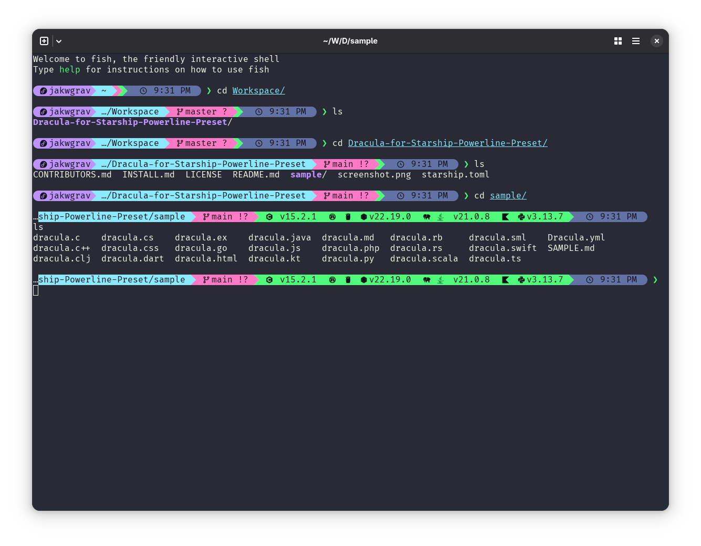

# Dracula for [Foobar](https://foobar.com)

> A dark theme for [Starship Powerline Preset](https://starship.rs/presets/).

## Install

All instructions can be found at [draculatheme.com/](https://draculatheme.com/foobar).

## Team

This theme is maintained by the following person(s) and a bunch of [awesome contributors](https://github.com/gillberg1111/Dracula-for-Starship-Powerline-Preset/graphs/contributors).

| | ---------------------------------------------------------------------------------------- | --------------------------------------------------------------------------------------------- |
| [Jake Graves](https://github.com/gillberg1111)                                               |

## Community

- [Twitter](https://twitter.com/draculatheme) - Best for getting updates about themes and new stuff.
- [GitHub](https://github.com/dracula/dracula-theme/discussions) - Best for asking questions and discussing issues.
- [Discord](https://draculatheme.com/discord-invite) - Best for hanging out with the community.

## Dracula PRO

## License

[MIT License](./LICENSE)
